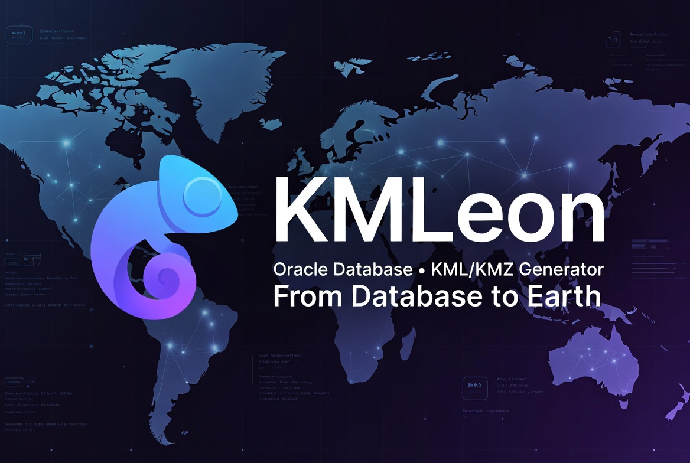

<p align="center">
  
</p>

<p align="center">
  <a href="LICENSE"></a>
  
  
  
  
</p>

<p align="center">
  <b>A generic, job-based KML/KMZ generator that runs entirely inside an Oracle database.</b><br>
  Your application decides <i>what</i> to map; KMLeon generically turns rows into KML/KMZ — no external runtime.
</p>

---

## Contents

- [Why KMLeon](#why-kmleon)
- [How it works](#how-it-works)
- [Components](#components)
- [Requirements](#requirements)
- [Install](#install)
- [Usage](#usage)
- [Configuration & maintenance](#configuration--maintenance)
- [Notifications](#notifications)
- [Demo app](#demo-app)
- [Feature mapping contract](#feature-mapping-contract)
- [Conventions](#conventions)
- [Roadmap](#roadmap)
- [License](#license)

## Why KMLeon

- **Pure PL/SQL, no moving parts.** Nothing to deploy outside the database — jobs are
  drained by a `DBMS_SCHEDULER` dispatcher (or run synchronously).
- **Generic.** KMLeon knows nothing about your domain. You supply geometries + metadata;
  it produces standards-compliant KML/KMZ.
- **Three ways to feed it, one render core:**
  - **Assets** — rows in a table (great for app-managed features).
  - **Query** — store a `SELECT`; it’s executed and **streamed** to KML at job time
    (the slow data-fetch runs *inside* the async job).
  - **GeoJSON** — push a FeatureCollection from outside (e.g. APEX REST).
- **Rich, standards-compliant KML.** Shared `<Style>` definitions (deduped to `styleUrl`),
  nested `<Folder>` hierarchies from `/`-separated paths, per-feature styling, and 3D
  (`altitudeMode` / `extrude` / `tessellate`). KMZ via `APEX_ZIP`.
- **Variable metadata per feature** — `name`, `description` (HTML balloon), and any extra
  attributes become `<ExtendedData>` automatically.
- **Run it your way.** Synchronous (`run_now`) or async via the `KMLEON_DISPATCHER`
  scheduler job that drains the `PENDING` queue by priority.
- **Completion e-mail.** `PCK_KML_NOTIFY` notifies on COMPLETED/FAILED with the result
  attached — generic and best-effort, with `resolve_recipient` / `send_mail` hooks.
- **Operational config & metrics.** A typed `KML_CONFIG` store keeps behaviour settings and
  auto-maintained metrics (last created / completed / failed / cleanup); a scheduled cleanup
  job purges old jobs by status + age, and finished jobs free their assets automatically.
- **REST-ready.** A drop-in ORDS script exposes the ASSETS path over HTTP.
- **Disciplined data layer** — every table is written only through its DML package, with
  central logging and uniform audit columns.

## How it works

```
  create_job + add_asset ──┐  ASSETS : app fills KML_JOB_ASSETS
  create_job_from_query  ──┤  QUERY  : app stores a SELECT (streamed at run time)
  add_features_geojson   ──┘  GeoJSON: app pushes a FeatureCollection
                             │
                             ▼
                    PCK_KML_ENGINE.run_job ───────► result_kml (CLOB)
                       ├─ SDO / GeoJSON → KML                  or
                       ├─ PCK_KML_KMZ.zip_kml ──────► result_kmz (BLOB)
                       ├─ PCK_KML_NOTIFY ──────────► completion e-mail (best-effort)
                       └─ free assets (DELETE_ASSETS_AFTER_SUCCESS) + stamp metrics

  DBMS_SCHEDULER ─ KMLEON_DISPATCHER  ──► PCK_KML_ENGINE.process_pending  (drain PENDING)
                 └ KMLEON_MAINTENANCE ──► PCK_KML_MAINTENANCE.cleanup     (purge old jobs)

  KML_CONFIG : SETTINGs (behaviour) + METRICs (last created / completed / failed / cleanup)
```

Job lifecycle: `DRAFT → PENDING → RUNNING → COMPLETED | FAILED | CANCELLED`.

## Components

| Object | Role |
|---|---|
| `KML_JOBS` | one row per export request + result + status (`PCK_KML_JOBS_DML`) |
| `KML_JOB_ASSETS` | one row per feature: geometry + metadata + style (`PCK_KML_JOB_ASSETS_DML`) |
| `KML_CONFIG` | typed key/value store: SETTINGs + auto-maintained METRICs (`PCK_KML_CONFIG_DML`) |
| `KML_LOG` | central log (`PCK_KML_LOG`) |
| `PCK_KML_ENGINE` | the generic generator: geometry→KML, assembly, execution, dispatcher |
| `PCK_KML_KMZ` | KMZ zipping (isolated `APEX_ZIP` dependency) |
| `PCK_KML_NOTIFY` | completion e-mail (file attached); generic, with `resolve_recipient` / `send_mail` hooks |
| `PCK_KML_MAINTENANCE` | config-driven cleanup of old jobs + its scheduler job |
| `PCK_KML_JOB_API` | optional convenience wrapper |
| `KMLEON_DISPATCHER` / `KMLEON_MAINTENANCE` | scheduler jobs: drain `PENDING` / scheduled cleanup |
| ORDS `kmleon.v1` | optional REST module (ASSETS path) — [`sql/ords/010_rest_api.sql`](sql/ords/010_rest_api.sql) |

## Requirements

- **Oracle Database 19c** — identity columns, native `JSON_OBJECT_T`/`JSON_ELEMENT_T`,
  and `SDO_UTIL.FROM_GEOJSON` (a 19c addition, hence the floor).
- **Oracle Spatial / Locator** (`SDO_UTIL`) — geometry conversion: `TO_KMLGEOMETRY`
  (KML out) and `FROM_GEOJSON` (GeoJSON in, **19c**).
- **APEX_ZIP** (ships with Oracle APEX) — only for `KMZ` output. Without it, `KML` still
  works and KMZ jobs fail with a clear message.

## Install

```sql
-- from the sql/ directory, as the schema that will own KMLeon
sqlplus kmleon/****@db @install.sql
@scheduler/010_scheduler.sql      -- enable the background dispatcher
```

Updating an existing install (non-destructive — keeps your data): `@update.sql`. It
creates any new table, recompiles all packages, and seeds missing config defaults.
Remove everything with `@uninstall.sql`. Smoke tests live in [`tests/`](tests).

## Usage

> The `PCK_KML_JOB_API` calls below are optional sugar over the DML packages — you may call
> those directly, but **never** write the tables with raw INSERT/UPDATE/DELETE.

<details open>
<summary><b>1 · App-managed features (ASSETS)</b></summary>

```sql
declare
  l_job number;
  l_a   number;
begin
  l_job := pck_kml_job_api.create_job('My export', p_output_format => 'KMZ',
             p_user_tab => 'APP_USERS', p_user_id => '42');

  l_a := pck_kml_job_api.add_asset(l_job,
           p_geometry_geojson => '{"type":"Point","coordinates":[13.405,52.52]}',
           p_name             => 'Berlin',
           p_extended_data    => '{"country":"DE"}',     -- shown in the balloon
           p_icon_scale       => 1.2);

  -- ... or native SDO_GEOMETRY:
  l_a := pck_kml_job_api.add_asset(l_job,
           p_geometry_sdo => sdo_geometry(2001, 4326, sdo_point_type(8.68,50.11,null), null, null),
           p_name         => 'Frankfurt');

  commit;
  pck_kml_job_api.submit_job(l_job);     -- dispatcher runs it; or run_now(l_job)
end;
/
```
</details>

<details>
<summary><b>2 · Query-driven, streamed (QUERY)</b></summary>

For large or slow exports, store a `SELECT` on the job. The dispatcher runs it *inside* the
job and streams each row straight to KML — **no assets persisted**. Column **aliases** drive
the output.

```sql
declare
  l_job number;
begin
  l_job := pck_kml_job_api.create_job_from_query(
    p_document_name => 'Stores by region',
    p_output_format => 'KMZ',
    p_source_binds  => '{"region":"DE"}',            -- bound as :region
    p_source_query  => q'[
        select shape       as geometry,              -- SDO_GEOMETRY column
               store_name  as name,
               region      as folder_name,
               opened_on   as opening_date,          -- unknown alias -> ExtendedData
               :region     as queried_region
          from stores
         where region = :region
         order by region                             -- ORDER BY folder to group
      ]');
  commit;
  pck_kml_job_api.submit_job(l_job);
end;
/
```

Pass `p_source_mode => 'MATERIALIZE'` to instead write rows into `KML_JOB_ASSETS` first and
then render — useful when you want the result persisted/inspectable/retryable. Streaming is
the lighter default.

> ⚠️ The query is dynamic SQL run with **this schema’s privileges** in the dispatcher (the
> requester’s context is gone). Only trusted apps may enqueue `QUERY` jobs, and **all
> parameters must be binds** — never string-concatenated.
</details>

<details>
<summary><b>3 · External push via GeoJSON (APEX REST)</b></summary>

When features come from outside the database, the client pushes them. Use an `ASSETS` job
plus `add_features_geojson`, which accepts a FeatureCollection (or a single Feature / bare
geometry) and bulk-inserts assets using the **same mapping contract**.

```sql
declare
  l_job number;
  l_n   number;
begin
  l_job := pck_kml_job_api.create_job('External upload', p_output_format => 'KMZ');
  l_n := pck_kml_job_api.add_features_geojson(l_job, q'[
    {"type":"FeatureCollection","features":[
      {"type":"Feature",
       "geometry":{"type":"Point","coordinates":[13.405,52.52]},
       "properties":{"NAME":"Berlin","FOLDER_NAME":"Cities","country":"DE"}}
    ]}]');
  commit;
  pck_kml_job_api.submit_job(l_job);
end;
/
```

A typical APEX REST surface:

```
GET    jobs                 list jobs
POST   jobs                 create an ASSETS job (JSON body)            -> DRAFT
POST   jobs/{id}/features   add_features_geojson (GeoJSON body)         [ASSETS]
POST   jobs/{id}/submit     submit_job                                  -> PENDING
POST   jobs/{id}/run        run synchronously now
POST   jobs/{id}/cancel     cancel a DRAFT/PENDING job
GET    jobs/{id}            status + metadata
GET    jobs/{id}/result     download the KMZ/KML
```

A **ready-to-run ORDS script** that creates exactly these endpoints (via the ORDS
PL/SQL API — no manual clicking) lives at
[`sql/ords/010_rest_api.sql`](sql/ords/010_rest_api.sql). Run it in **APEX → SQL
Workshop → SQL Scripts**. The `QUERY` source is deliberately **not** exposed over
REST; secure the module before using it (see the script's header).
</details>

## Configuration & maintenance

`KML_CONFIG` is a typed key/value table holding two kinds of rows (written only via
`PCK_KML_CONFIG_DML`):

- **METRICs** — auto-maintained, best-effort. The jobs DML package stamps
  `METRIC_LAST_JOB_CREATED_AT`, `…_COMPLETED_AT`, `…_FAILED_AT`, `…_CANCELLED_AT`;
  the cleanup job stamps `METRIC_LAST_CLEANUP_AT` / `…_DELETED`. A metric write can
  never break the surrounding job transaction.
- **SETTINGs** — behaviour switches. `DELETE_ASSETS_AFTER_SUCCESS` (default **ON**):
  after a job builds successfully, `run_job` deletes that job's stored
  `KML_JOB_ASSETS` rows (best-effort, separate transaction — the result stays on the
  job; note a later re-run of an `ASSETS` job then has no input). Plus the cleanup
  job: `CLEANUP_ENABLED`, `CLEANUP_INTERVAL` (DBMS_SCHEDULER calendar),
  `CLEANUP_RETENTION_DAYS`, `CLEANUP_STATUSES`.

`PCK_KML_MAINTENANCE.cleanup` reads those settings and purges old jobs (+their
assets) via `PCK_KML_JOBS_DML.purge` — **only terminal statuses** (`COMPLETED` /
`FAILED` / `CANCELLED`) are ever deleted, regardless of what `CLEANUP_STATUSES`
lists. `apply_schedule` (re)creates the `KMLEON_MAINTENANCE` scheduler job from the
current config:

```sql
exec pck_kml_config_dml.set_boolean('CLEANUP_ENABLED', true);
exec pck_kml_config_dml.set_number ('CLEANUP_RETENTION_DAYS', 30);
commit;
@scheduler/020_maintenance.sql        -- applies the schedule
-- run once, ignoring the enabled switch:
declare n pls_integer; begin n := pck_kml_maintenance.run_cleanup(p_force => true); end;
```

Read settings with `pck_kml_config_dml.get_string/get_number/get_timestamp/get_boolean`.
Reinstalling preserves edited values (`init_defaults` only inserts missing keys).

## Notifications

On COMPLETED and FAILED, `run_job` calls `PCK_KML_NOTIFY.notify` **best-effort** — a notify
error can never change the job's committed status. It builds a generic subject/body with the
result as an attachment and hands it to a sender. Out of the box it only logs; wire it to
your mail stack by editing the two `-- CUSTOMIZE HERE` hooks:

- **`resolve_recipient(user_tab, user_id)`** — map a job's creator to an address.
- **`send_mail(...)`** — actually send (e.g. `APEX_MAIL` / `UTL_SMTP`).

The recipient is `KML_JOBS.notify_email` when set (wins, e.g. for REST callers), otherwise
`resolve_recipient(user_tab, user_id)`. `notified_at` is stamped via the DML package.

## Demo app

A small **APEX 26.1** app (human-readable *APEXLang* `.apx` format) lives under
[`apex_demo/`](apex_demo/). It exercises the full toolkit — create a job from GeoJSON
or a `SELECT`, run it, browse jobs and their assets, preview geometries on a Map region,
download the KML/KMZ, and inspect `KML_LOG`. Import it with SQLcl
(`apex import -input apex_demo`) or as a zip via App Builder, then seed with
`apex_demo/demo_data.sql`. See [`apex_demo/README.md`](apex_demo/README.md).

## Feature mapping contract

The internal `QUERY` source (SQL column aliases) and the external GeoJSON source (Feature
`properties`) share one contract — reserved names map to roles, **everything else becomes an
`<ExtendedData>` property**:

| Role | Reserved name(s) |
|---|---|
| Geometry | `GEOMETRY` / `GEOMETRY_SDO`, `GEOMETRY_GEOJSON`, `GEOMETRY_KML` |
| Placemark | `NAME`, `DESCRIPTION`, `FOLDER_NAME`, `VISIBILITY` |
| Style | `ICON_HREF`, `ICON_SCALE`, `LABEL_COLOR`, `LABEL_SCALE`, `LINE_COLOR`, `LINE_WIDTH`, `POLY_COLOR`, `POLY_FILL`, `POLY_OUTLINE` |
| Placement | `ALTITUDE_MODE`, `EXTRUDE`, `TESSELLATE` |
| Extra | `EXTENDED_DATA` (a JSON object), plus *any other column/property* |

- Geometry is **lon/lat** (X = longitude), SRID **4326**.
- **Colors** are KML `aabbggrr` hex — convert from `RRGGBB` with
  `PCK_KML_ENGINE.rgba_to_kml('FF0000')` (+ optional 0–255 alpha).
- `FOLDER_NAME` groups features into `<Folder>`s; use `/` to nest
  (e.g. `Europe/Germany`). Order rows by it so groups stay contiguous.

See [`docs/data-model.md`](docs/data-model.md) for the full column reference and limitations.

## Conventions

- **Packages are named `PCK_*`.**
- **No direct DML on tables** — every table is written only through its DML package.
- **Central logging** via `PCK_KML_LOG` (autonomous transaction, survives rollback).
- **Audit columns** `created_at / created_by / updated_at / updated_by` on every table,
  auto-stamped by the DML package when passed NULL.

## Roadmap

- `<StyleMap>` (normal/highlight) styles.
- A utPLSQL test suite.

*(KMZ uses `APEX_ZIP`; a pure-PL/SQL ZIP fallback was intentionally dropped — APEX
is assumed available in the target environment.)*

## License

[MIT](LICENSE) © KMLeon contributors.
